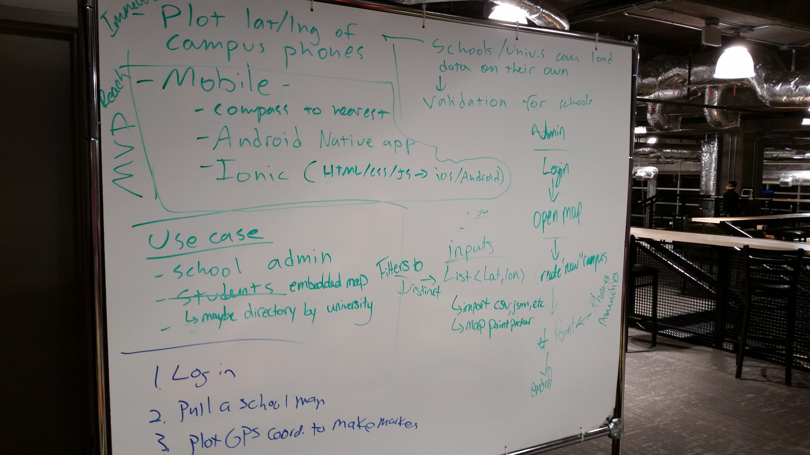
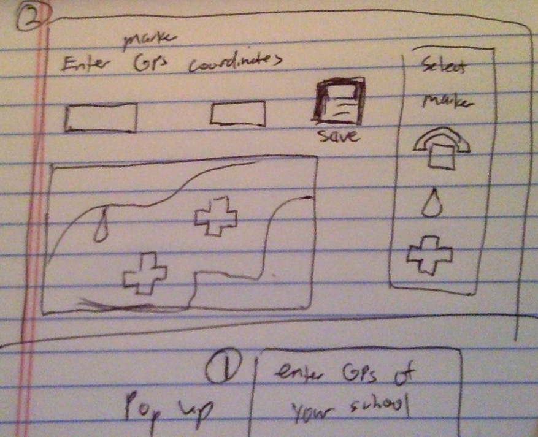
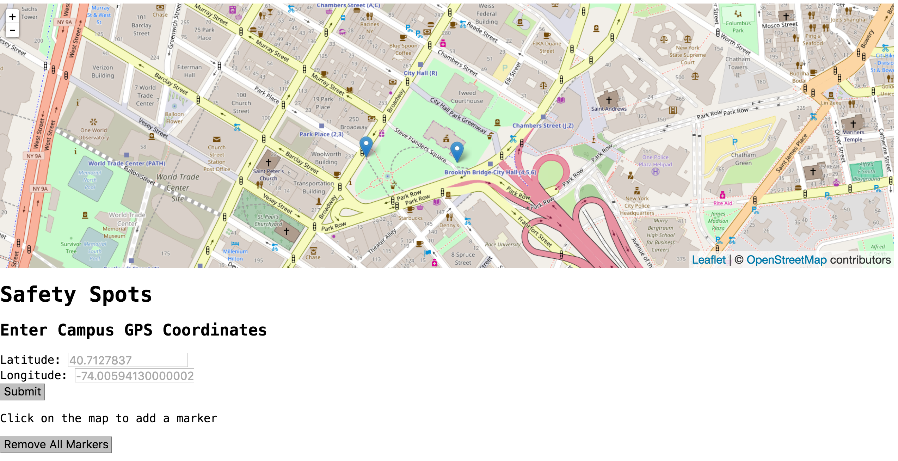
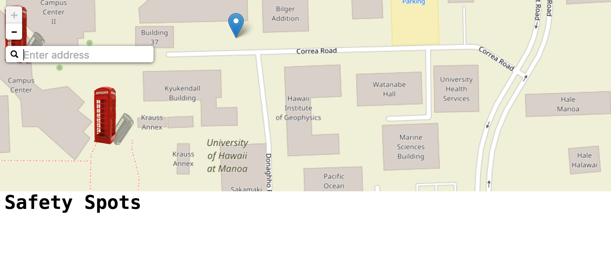

# cfaCampus-Safety
A project for Code for Atlanta: Safety Spots

## The Challenge 
To create a map that marks all the emergency phones/booths on a campus. Additional feature was to create a backend portion to log user credentials so that students could store other markers for other events (e.g. water booths for a 5K run).


Me at "The Garage" explaining my frontend portion that used leaflet maps
[](https://www.facebook.com/codeforatlanta/photos/a.965856256801736.1073741827.134637019923668/1142606072460086/?type=3&theater)


Our brainstorm of ideas on different features and technologies to incorporate


A sample blueprint of what I want the app to look like


My first MVP with GPS coordinate fields


My second MVP refactored into vanilla javascript and hand input fields into searchable icon plus custom phone markers



## My Milestones to reach
* Get a sample Leaflet map to work
* Understand how Leaflet markers work, replace them with a library of safety icons (phones, waterbooths for marathons, etc.)
* Create frontend that allows for people to enter GPS coordinates and make markers based on CRUD functionalities
* If there's lots of time left, make a login at the request of Code for Atlanta (but really, a service like this shouldn't need a login IMHO)


# Obstacles
## Binding input fields to Controller using Angular
Got really close to polishing up an MVP. Right now, it has school GPS coordinates hardcoded and ability to make markers. However, I had a tough time understanding how "angular.extend" works. Little googling brought me to a good example. Let's consider the following transformation:

Traditionally, how to write a function for ng-click would looks like this if modifying an object:

```js
app.controller(‘ThingController’, [ ‘$scope’, function($scope) {
   $scope.thingOne = ‘one’;
   $scope.thingTwo = ‘two’;
   $scope.getThings = function() { 
       return $scope.thingOne + ‘ ‘ + $scope.thingTwo; 
   };
}]);
```
With angular.extend it'll look like this:

```js
app.controller(‘ThingController’, [ ‘$scope’, function($scope) {
    angular.extend($scope, {
        thingOne: ‘one’,
        thingTwo: ‘two’,
        getThings: function() { 
            return $scope.thingOne + ‘ ‘ + $scope.thingTwo; 
        }
    });
}]);
```

Examples courtesty of here: [http://moduscreate.com/angularjs-tricks-with-angular-extend/](http://moduscreate.com/angularjs-tricks-with-angular-extend/)

However, even with that implementation, there's still something fishy happening with how my input values are being bound to the function. I'm seeing error messages with "[AngularJS - Leaflet]  invalid 'center' " ...getting closer.

## Possibly converting whole project to ReactJS
I've made the quintessential todo app using React. I'm pretty confident on converting my logic into components but not sure how it'll work once I incoporate NodeJS for the backend. With regards to earlier issues like the input fields, I ended up refactoring them into vanilla Javascript. More details on that later.

## Future contributions I'd like the community to add
I'd like for the ability for users to upload their own custom markers. I think this can be accomplished with the NPM module, [busboy](https://www.npmjs.com/package/busboy)

This way, the map doesn't have to be limited to just emergency phones. It could be used to make maps of any kind with different markers. For example, if people ran a 5k, they could find out where the water stations are or first aid. Or people could use this app to make scavenger hunt for when they propopse to their significant others.

### Side notes and Resources:
Found nifty plugin to adding 'search' for map [here](https://github.com/smeijer/L.GeoSearch)

How to [make custom icon markers](http://leafletjs.com/examples/custom-icons/)

This [fiddle](http://jsfiddle.net/kedar2a/5VLJU/8/) helped me understand how to make markers without the use of scopes

Thanks http://www.gps-coordinates.net/ for the [GPS Coordinates](http://www.gps-coordinates.net/)
